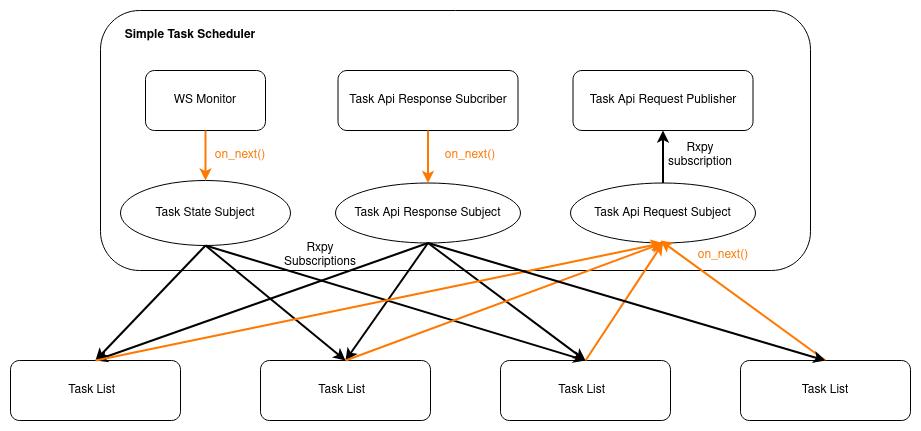

# Task Scheduler
This repository is a collection of packages of different type of task schedulers

# Introduction
Types of Task Schedulers
* [simple task scheduler](#simple-task-scheduler)

## Simple Task Scheduler
The simple task scheduler manges the dispatching of tasks for each task list. A task list is a list of task that are to be executed sequencially in order. Each task list is independent of each other. These `TaskList` objects manage their own list of tasks while getting information from the `SimpleTaskScheduler` object via `rx.subject.subject.Subject`.



### Configuration files
The Simple Task scheduler requires a configuration file to know how many `TaskList` objects to load and the list of task within each task list. All these information can be specified in yaml format be it in a single file or multiple files to keep organised.

#### Overall Config File
The overall config file basically specifies the list of task lists that the `SimpleTaskScheduler` would be managing. This overall config file contains a **list** of task lists. To declare a task list you need two attributes:
1. [list_file](#task-list-file) - The name of the yaml file containing the task list info
2. num_loops - The number of times this task list should be executed. (-1 is an infinite loop)

```yaml
- list_file: task_list_1.list.yaml
  num_loops: -1

- list_file: task_list_2.list.yaml
  num_loops: 2
```

refer to [here](./simple_task_scheduler/config/task_lists.yaml) for an example

#### Task List File
This file contains the list of tasks for a **single** task list. The tasks declared in this list can be in plain yaml or hosted on a separte yaml file. For expressing a task in plain yaml set the `type` attribute to 'dict'. For expressing the task in a separate yaml file, set the `type` attribute to 'yaml_file`.

In the task list file:
```yaml
- type: yaml_file
  yaml_file: coke_delivery.task.yaml

- type: dict
  fleet:
  robot:
  category: compose # request category
  description:
    category: go_to_place
    phases:
    - activity:
        category: go_to_place
        description:
          waypoint: stock_holding_2
          orientation: 3.14
```
<br></br>
In delivery.yaml (Note that this is not a list but a single task):

```yaml
fleet:
robot:
category: delivery # request category
description:
  pickup:
    place: office
    handler: lounge_dispenser
    payload:
      sku: coke
      quantity: 1
  dropoff:
    place: office
    handler: office_ingestor
    payload:
      sku: coke
      quantity: 1
```

refer to [here](./simple_task_scheduler/config/task_list_1.list.yaml) for an example using plain yaml and [here](./simple_task_scheduler/config/task_list_2.list.yaml) for an example with task files.

#### Future Improvements
* Start/ Pause specific task lists
* Add new task lists